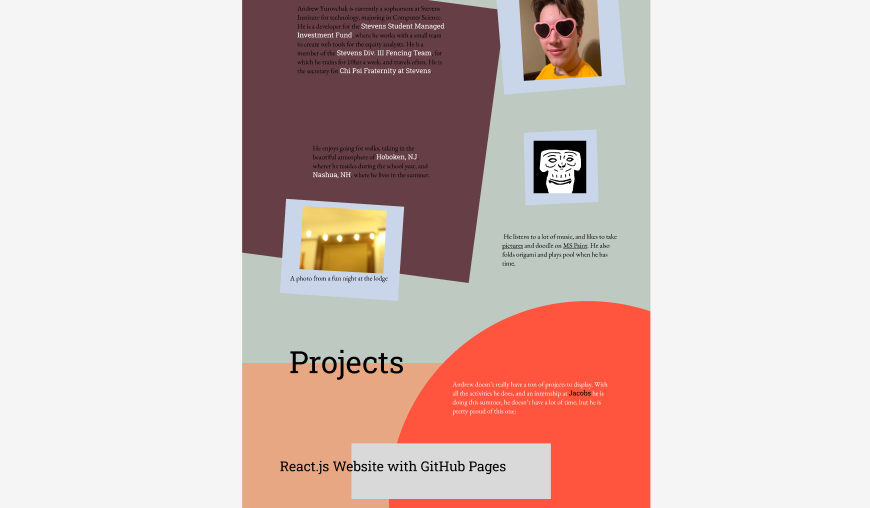

+++
title = "Portfolio Website"
date = 2024-05-01
+++

A portfolio website is something that nearly every developer has, and is something that I had been wanting to create ever since I learned how to make basic static webpages, which was almost a year ago. However, I tend to be a bit of a perfectionist when it comes to personal projects, which is really bad if you ever want a working product in a reasonable amount of time. The significance of a personal portfolio website really intensified this perfectionism, and I think that this is why this website has been almost a year in the making now.

This is actually my second attempt at a portfolio website. After working on it obsessively almost every day for about a month, I started to feel burnout, and when schoolwork started picking up, I decided to stop working on it entirely. It was unorganized and badly planned, and even though I have the same amount of experience in creative web design as I do now, it was pretty weird looking. I had no idea how to make it responsive to the screen size, nor did I have even the remotest idea on how to build and host it.

In the spring of 2024, I started working as a developer for SSMIF, and there I learned a lot about how to be a productive web developer, not just a designer. As schoolwork wound down, I decided to have another go at the portfolio website. This time, to avoid burnout, I decided to focus on adding small features in a managable way. One of the first things I started with was creating a project base that I could easily deploy to github pages, and I think that being able to see the changes I made live on the web really helped me keep going with this project.

## Technical Details

For the base of this project, I used create-react-app, without all of the testing and analytics stuff. To publish it to github pages, I used the gh-pages npm package, which I found a lot easier than manually building a pushing to a dedicated github-pages branch. One of the main things I had wanted to implement was some sort of 3d model viewing, but after going through the process of making a working website, I decided that that that would have to wait. For the routing, I used react-router, which was really easy to pick up and integrate into my existing project. However, due to the nature of github pages, displaying multiple pages meant I had to use the hash router, which shows different pages to the user depending on what url fragment they are pointed to. This was heavily discouraged by the react-router docs, and gives me a sense of unease. Eventually, I will have my own server or AWS instance for hosting my personal projects, and I will have to move this website over when it happens.

One of the things I am most proud of in this project is the smooth scrolling and the parallax effect(some content moving at different rates than others). This was something that I was able to get working on my last project, but only to a degree where it made it a lot harder to make a cohesive design.

## The Process

I did originally have a Figma page for this website, but making an initial design and actually creating it are two different stories, at least on your first time using figma. The design I had originally made went through a lot of changes, and the final product looks very different from what I had planned it to be.

Getting the website to scale between different screen sizes was very hard because I had already done most of the design and styling without thinking about responsive scaling. I also only used pure css for the styling, so navigating it and figuring out which rules applied to which elements was a nightmare. I will most definitely be using tailwind in the future.

One of the things that I found helped me the most is the mantainence of a task list. I kept this in the readme, and it really helped me keep track of what I wanted to get done with the website, and what my goals were.

Overall, I do think this was an enjoyable and rewarding experience, even if it did take a bit long for my liking.

The repo can be found at <https://github.com/andrewyur/andrewyur.github.io>.
