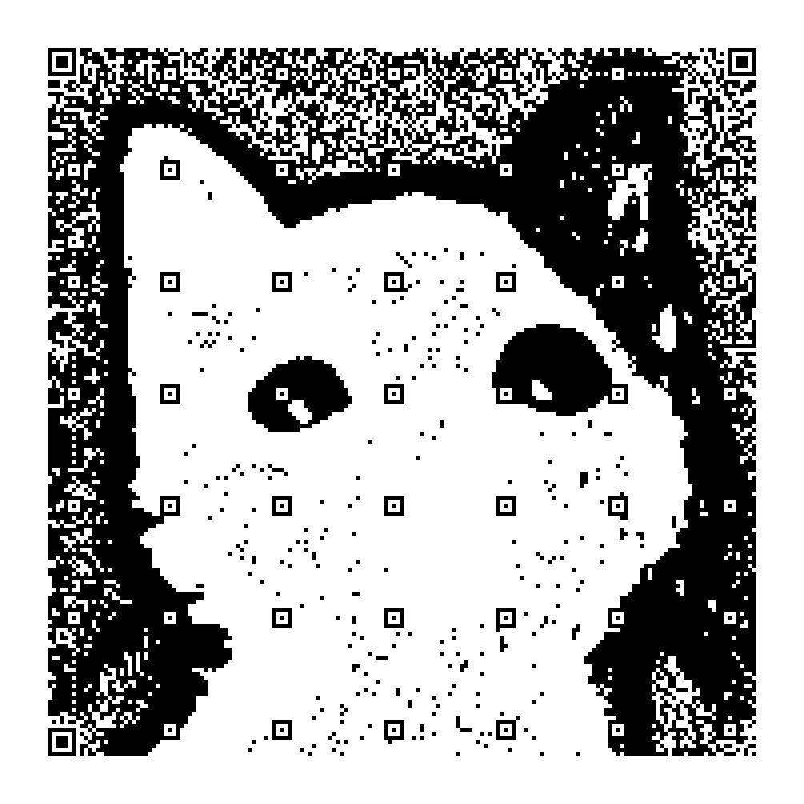
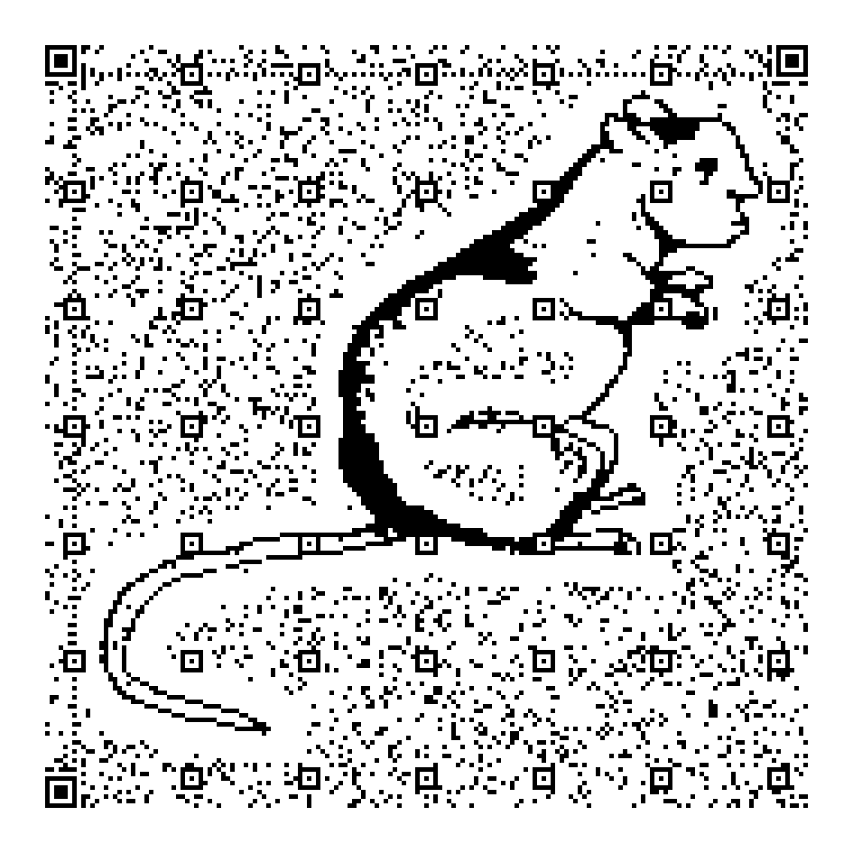
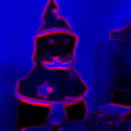

+++
title = "QArt Encoder"
date = 2024-06-01
+++

Something that has been on my todo list for a long time has been to replicate [this website](https://research.swtch.com/qr/draw/). It seemed like something that would be both interesting to the user and interesting for me to code, which is a rare thing for coding projects. It ended up turning out pretty well, the program not only works great, but is faster than all of the other implementations by at least a factor of 100x (this is documented in the repo readme), and the [published crate](https://crates.io/crates/qart) is sitting at 350 downloads at the time of writing. To see more about how it works, I think Russ Cox's [original article](https://research.swtch.com/qart) explains the overall process quite well, so I won't repeat it here.

## Technical Details

This project was my first real use of Rust after reading the book for about a month straight, and it was an amazing experience. My only other real expericence with low-level programming was C, and the difference between the two was night and day. In my experience with C, I only spent about half the time coding, and the rest of the time debugging, because even if there was something wrong with the memory allocation, the program would still compile and run, but exhibit the ever-dreaded "undefined behavior". On the other hand, Rust was a joy to debug, and the type system, functional programming features, zero cost abstractions, and "fearless concurrency" made the development experience one of the best I have had to date. Cargo was really nice to work with as well.

## The Process

The QR Code specification is ridiculously complex, and creating my first working QR code took about as long as it did to implement the image encoding part. There aren't many resources for this kind of thing on the internet, but thankfully I did find a couple that helped me immensely. This project would probably have been abandoned without [Thonky.com's QR Code Tutorial](https://www.thonky.com/qr-code-tutorial/), and [Project Nayuki's step-by-step QR Code Generator](https://www.nayuki.io/page/creating-a-qr-code-step-by-step), which I used to check my work at different stages throughout the process.

There were even less resources for the image-encoding part of the project, all I had to go off of was Russ Cox's original article (which did not explain anything in detail), and 2 other implementations of QArt code generators that were not documented at all. After staring at the article and the code for a couple days, I decided to try and translate every detail of the code into Rust, without worrying about understanding it, and this helped my understanding immensely. There were a couple changes I had to make to get the code to play nice with the borrow checker, and I don't think I could have done this without exactly understanding what my code was doing.

After implementing the main functionality, my code was very, very messy, and I had to spend a couple days cleaning it up. Eventually, I reached a point where I did not feel it was worth it to clean it up any further, as I didn' have an obligation to keep my code readable to any colleagues or maintainers, and so I focused on getting a command-line parser working before I lost interest in the project. Thanks to a crate available on cargo, this was not that difficult, and I was able to publish my crate pretty quickly. To my surprise, the crate reached 30 downloads before I was able to finish editing the readme after publishing, and reached 200 downloads overnight. Overall, this was a very rewarding experience, and I am thankful I had the time and dedication to push through the ~1 month long process.

View the repo [here](https://github.com/andrewyur/qart), or the published crate [here](https://crates.io/crates/qart).
